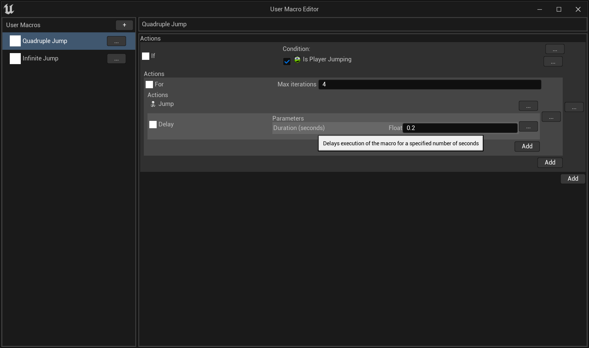
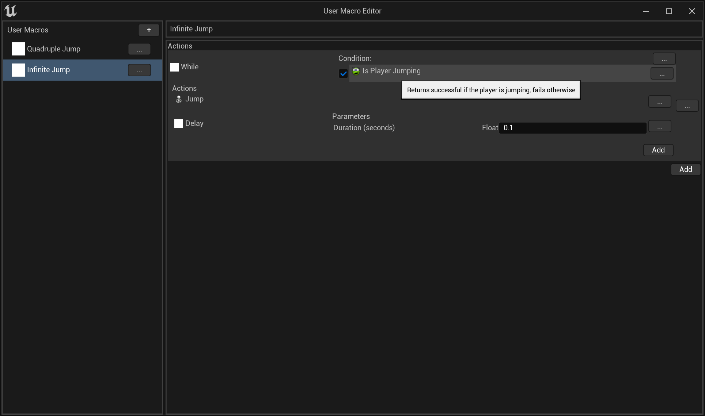
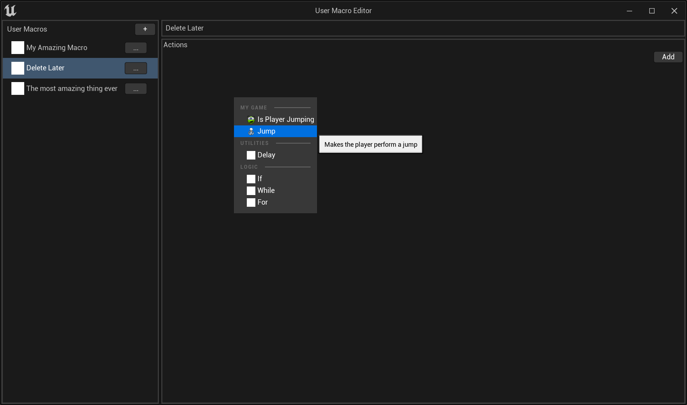

# Unreal Engine Macro System

This is very unstable and buggy, and is more a proof of concept than anything substantially useful. It's built on UE5.2, and uses Slate heavily (only the macro editor is exposed as a `UWidget`).
There's little documentation, but more will come as I flesh it out. Feel free to use or extend this as you wish.

